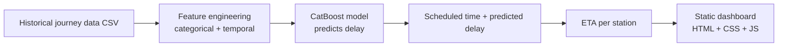

<div align="center">

# 🚆 Dynamic ETA Prediction for Trains

**Machine learning that predicts train delays, plus a live dashboard that turns them into station-by-station arrival times.**

[](https://maegortargaryn.github.io/Dynamic-eta-prediction-for-Trains/)


</div>

---

## 📌 Overview

Published train timetables rarely match what happens on the track. Delays at one station ripple down the route, and passengers and operations teams are left guessing.

This project predicts how late a train will be at each station using **historical station data and delay patterns**, then adds that predicted delay to the scheduled time to give a realistic **estimated time of arrival (ETA)**.

```
ETA = scheduled arrival time + predicted delay (minutes)
```

The model is built with **CatBoost**, which handles categorical features such as station and train directly and captures temporal patterns like time of day and day of week. A static dashboard presents the results in an operations-style view.

## ✨ Features

- 🤖 **CatBoost delay model** trained on historical journey records
- 🕒 **Temporal and categorical features** that capture when and where delays happen
- 📍 **Station-by-station view** with scheduled time, predicted delay, ETA and status
- 🚉 **Route selector** to explore any train route in the data
- 🌙 **Dark operations dashboard** that works on desktop and mobile
- 🌐 **Zero-backend deployment** as a static site on GitHub Pages
- ⚙️ **Automated deploys** through GitHub Actions

## 🔄 How it works



1. **Data**: schedule and delay records are loaded from CSV files.
2. **Features**: station, train and route are treated as categorical features, and timing signals as temporal features.
3. **Model**: CatBoost learns delay patterns from past journeys.
4. **ETA**: predicted delay minutes are added to each scheduled arrival.
5. **Dashboard**: the ETAs and route status are shown station by station.

## 🧰 Tech stack

| Layer | Tools |
|---|---|
| Machine learning | Python, CatBoost, Jupyter Notebook (the training notebook also includes LSTM and GRU experiments) |
| Data | CSV schedule and delay files |
| Frontend | HTML, CSS, vanilla JavaScript |
| Deployment | GitHub Pages, GitHub Actions |

## 📁 Project structure

```
Dynamic-eta-prediction-for-Trains/
├── .github/workflows/                  # GitHub Pages deploy workflow
├── models/                             # Trained model files
├── index.html                          # Dashboard page
├── app.js                              # Dashboard logic and ETA calculation
├── styles.css                          # Dashboard styling
├── training_cat_boost_lstm_gru.ipynb   # Model training notebook
├── train_schedule_with_arrival_times (1).csv   # Schedule data
├── fffgfggcccgcg_combined.csv          # Combined delay and journey data
├── package.json
└── README.md
```

## 🚀 Getting started

### Run the dashboard locally

The dashboard is static, so any local web server works.

```bash
git clone https://github.com/Maegortargaryn/Dynamic-eta-prediction-for-Trains.git
cd Dynamic-eta-prediction-for-Trains
python -m http.server 8000
```

Open <http://127.0.0.1:8000/index.html> in your browser.

### Retrain the model

```bash
pip install catboost pandas numpy scikit-learn jupyter
jupyter notebook training_cat_boost_lstm_gru.ipynb
```

Run the notebook cells in order. The trained model is saved to `models/`.

> Install any other libraries the notebook imports. Add a `requirements.txt` later to make this one command.

## 🌐 Deployment

The project is pure static HTML, CSS and JavaScript, so it deploys directly to GitHub Pages. A workflow in `.github/workflows/` publishes it automatically on every push.

Manual setup: **Settings → Pages → Deploy from branch → `main` / root**.

## 📊 Results

| Metric | Value |
|---|---|
| MAE (minutes) | 1 |
| RMSE (minutes) | 3 |
| Baseline (scheduled time only) | 20 |

> Fill in these numbers from your notebook output. Comparing against the "no prediction" baseline shows how much the model improves on the timetable.

## 🗺️ Roadmap

- [ ] Add `requirements.txt` and a one-command setup
- [ ] Show model error metrics in the dashboard
- [ ] Add feature importance charts
- [ ] Live delay data feed
- [ ] Delay propagation across connected trains
- [ ] Rename the CSV files to clear, descriptive names

## 🤝 Contributing

Suggestions and pull requests are welcome. Open an issue to discuss a change first.

## 👤 Author

**Dishubh Singh** · [GitHub](https://github.com/Maegortargaryn)

---

<div align="center">

⭐ If this project helped you, consider giving it a star.

</div>
